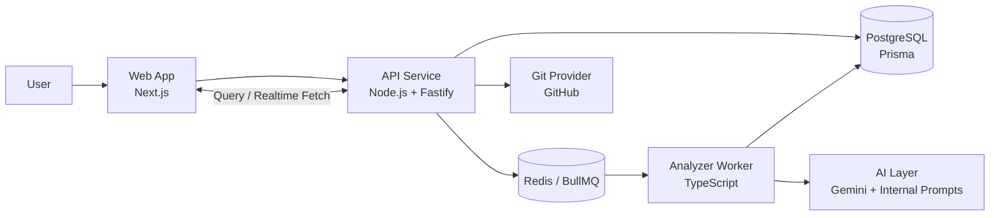
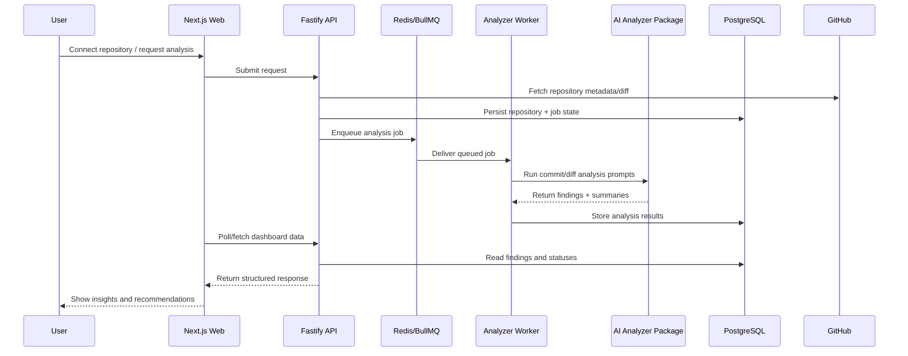

# Agentic Engineering Workflow AI

An event-driven, AI-powered SaaS platform for engineering workflows.

## Live Demo

- Web App: https://reposage-web.vercel.app

## Architecture Diagram

## System Flow

## Tech Stack

- Frontend: Next.js (App Router), React, TypeScript, Tailwind CSS
- Backend API: Node.js, Fastify, TypeScript
- Worker Layer: BullMQ-based background processing with TypeScript workers
- AI: Shared AI package (`packages/ai`) with Gemini integration and prompt modules
- Data: PostgreSQL with Prisma ORM and migrations
- Queue/Cache: Redis
- Monorepo: npm workspaces with structured apps/packages/workers separation
- Deployment: Vercel (web + API), containerized/background worker runtime

## Monorepo Structure

- **apps/**: Deployable applications (`web`, `api`)
- **workers/**: Background workers (`analyzer`)
- **packages/**: Shared libraries (`ai`, `config`, `shared`)
- **infra/**: Infrastructure configuration (`db`, `redis`)

## Getting Started

Prerequisites: Node.js, pnpm (recommended) or npm/yarn.

1. Install dependencies: `npm install`
2. Configure environment variables (see `packages/config` and app-level `.env` files)
3. Run services individually (`apps/api`, `apps/web`, and `workers/analyzer`)
